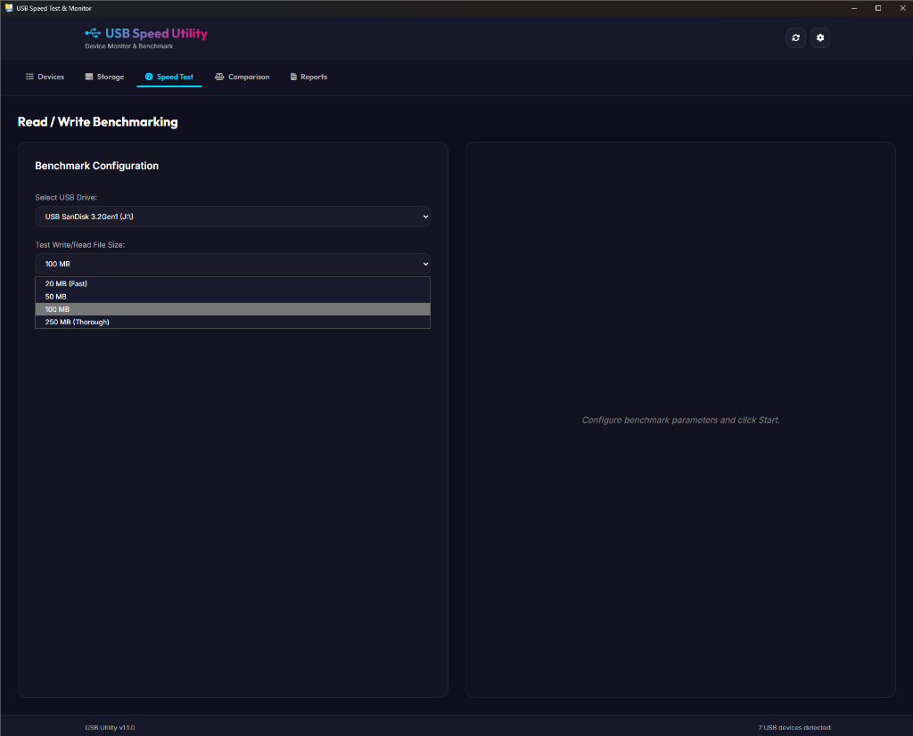
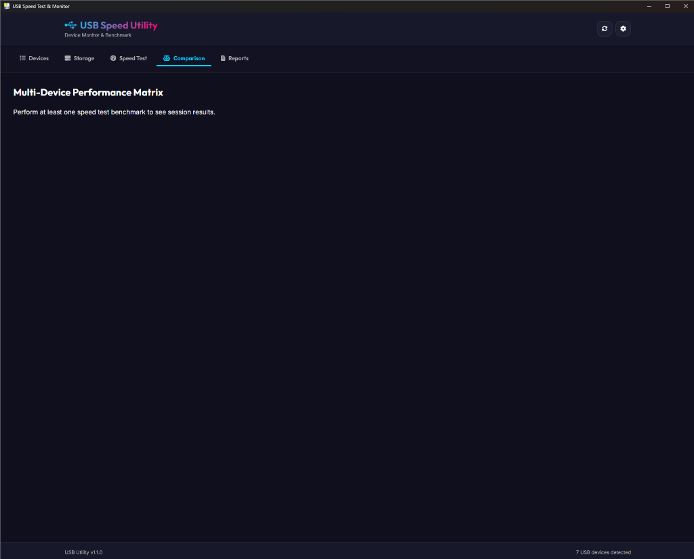
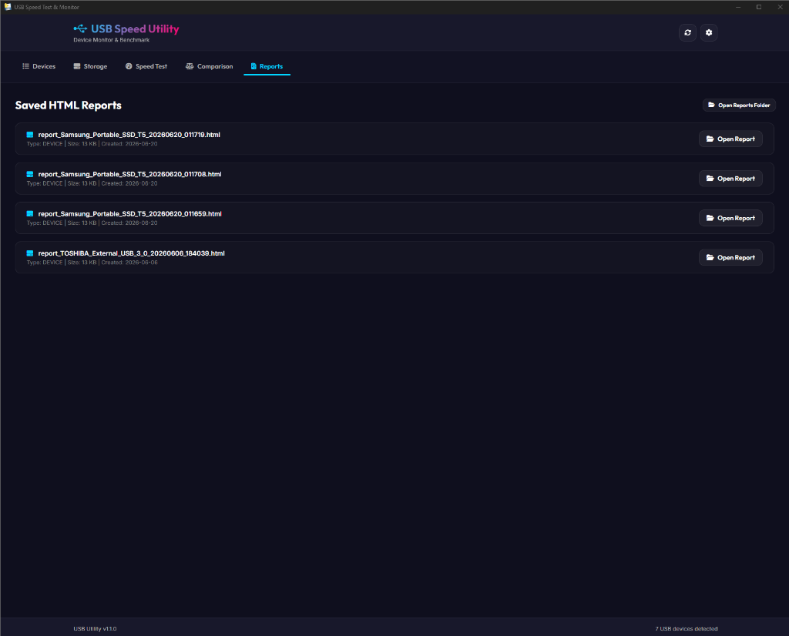
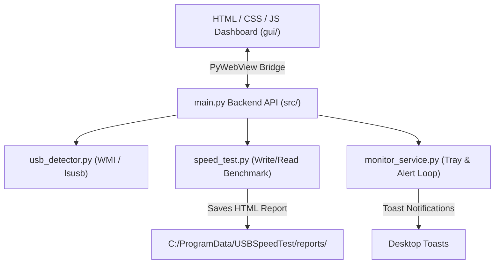

# USB Speed Utility & Monitor 🚀

A premium, lightweight, cross-platform desktop application built with Python (`pywebview`) and a responsive web frontend. The tool allows users to diagnose connected USB peripherals, run accurate read/write speed benchmarks, perform side-by-side performance comparisons, and monitor disk space with system tray integrations.

---

## 🖥️ User Interface Tour

Below is a visual walk-through of the application's tabs and design:

### 1. Devices Tab (Connected Peripherals)
*Lists all connected USB peripherals and hardware details (removability, mount point, classes).*


### 2. Storage Tab (Disk Space Analysis)
*Displays high-contrast storage consumption percentages and file systems for connected drives.*


### 3. Speed Test Tab (Benchmark Configuration)
*Allows selecting files sizes (20MB to 250MB) and executing safe write/read benchmarks.*


### 4. Comparison Tab (Multi-Device Matrix)
*Enables selecting multiple session test runs to generate comparative performance matrices.*


### 5. Reports Tab (Saved Benchmarks)
*Lists all saved detailed HTML reports with direct access to open them in your web browser.*


---

## 📸 Key Features

*   **USB Peripheral Analyzer**: Automatically lists all connected USB hardware (Storage Drives, Audio Devices, Cameras, Input Devices, and other peripherals) using native system commands (PowerShell/WMI, `diskutil`, `lsusb`).
*   **Speed Benchmarking**: Executes precise write and read tests with real-time speedometers. Enforces hardware cache flushes (`os.fsync`) to prevent RAM buffering from inflating benchmark results.
*   **Side-by-Side Comparison**: Select multiple previous test runs to compile performance matrices.
*   **Disk Space Analysis**: High-contrast visual storage bars displaying occupied vs. free capacity.
*   **Background Monitoring & Tray Integration**: Runs as a lightweight system tray service. Automatically runs checkups to alert users of low disk space on connected USB storage devices via native system toasts.
*   **Local-Only Configuration**: Saves settings locally inside your run directory or user data folder. No telemetry, no external connections.

---

## 🛠️ Architecture



---

## 📁 Repository Structure (GitHub Standards)

This repository maintains a clean, modular structure conforming to standard Python packaging and GitHub best practices:

```text
├── docs/                       # Project documentation
│   ├── images/                 # User interface screenshots
│   └── ProjectDocs/            # BRD, PRD, and Implementation plans
├── gui/                        # Frontend UI assets
│   ├── app.js                  # Frontend controllers and API bridge
│   ├── index.html              # Dashboard interface structure
│   └── style.css               # Premium dark glassmorphic design system
├── src/                        # Main application source code
│   ├── main.py                 # Application entry point & webview window loop
│   ├── config.py               # Configuration loading/saving logic
│   └── modules/                # Core modular services
│       ├── monitor_service.py  # Background space checker & tray icon
│       ├── platform_utils.py   # Cross-platform file/folder opener utilities
│       ├── speed_test.py       # Speed test block writing/reading algorithms
│       └── usb_detector.py     # USB peripheral & storage enumerators
├── build.bat                   # Compilation script for PyInstaller
├── USBSpeedTest.spec           # PyInstaller build specification
├── requirements.txt            # Python dependencies manifest
├── .gitignore                  # Git exclusion rules
└── README.md                   # Project overview & documentation
```

---

## ⚙️ Getting Started & Installation

Follow these instructions to download the project locally, set up the environment, run the application, and compile it into a standalone executable.

### 1. Download the Project Locally

Clone the repository to your local machine using Git:

```bash
git clone https://github.com/pellurisrinath/USBSpeedTester.git
cd USBSpeedTester
```

### 2. Environment Setup (Recommended)

It is highly recommended to use a Python virtual environment to keep dependencies isolated:

```bash
# Create a virtual environment
python -m venv venv

# Activate the virtual environment
# On Windows (Command Prompt):
call venv\Scripts\activate
# On Windows (PowerShell):
.\venv\Scripts\Activate.ps1
# On macOS / Linux:
source venv/bin/activate
```

### 3. Install Dependencies

Install all the required python libraries using the provided `requirements.txt`:

```bash
pip install --upgrade pip
pip install -r requirements.txt
```

### 4. Running the Application from Source

Launch the desktop interface by running the main entry script:

```bash
python src/main.py
```

### 5. Compiling to a Standalone Executable (`.exe`)

You can bundle the entire application—including the Python runtime, script logic, and all web frontend assets (`gui/` folder)—into a single, portable executable file. This allows end-users to run the tool without needing Python installed.

To compile the application, run the automated build script:

```cmd
# On Windows:
build.bat
```

The script will automatically:
1. Run PyInstaller using `USBSpeedTest.spec`.
2. Bundle `gui/` directory files inside the executable's assets.
3. Package the final `.exe` under the `dist/` folder.

Once complete, your standalone executable will be located at:
📁 **`dist/USBSpeedTest.exe`**

---

## 🔒 Security & Privacy Statement

This application is designed with privacy-first principles:
1. **No External Telemetry**: The app operates fully locally and does not upload metrics to any cloud servers.
2. **Local Storage**: All settings are stored in `config.json` inside the user’s local folders (`C:\ProgramData\USBSpeedTest` or the installation directory).
3. **No Hardcoded Keys**: The application contains no embedded API keys, secret credentials, or personal tokens. If you utilize cloud integrations, keys are stored locally on your machine and are only transmitted directly to the official vendor APIs (e.g. OpenAI, Anthropic) without intermediate proxies.

---

## 📄 License

This project is licensed under the MIT License. Feel free to modify, distribute, and integrate it into your own systems.
