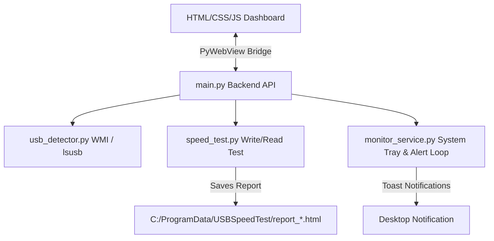

# Project Documentation - USB Speed Test & Monitor

## Project Specifications

- **Project Name**: AntiGravity USB Speed Test Utility
- **Version**: 1.0.0
- **Build System**: PyInstaller (produces standalone binary)
- **Runtime Environment**: Python 3.10+
- **Production Directory**: `C:\ProgramData\USBSpeedTest\` (Target folder for HTML reports and standalone installation on Windows)

## Design Architecture

## Dependencies
- `pywebview`: Native UI shell wrapper.
- `psutil`: Cross-platform storage disk usage query.
- `pystray`: Cross-platform system tray icon configuration.
- `plyer`: Native toast notification broadcast.
- `Pillow`: Programmatic tray icon image generation.

## Implementation Details

### USB Peripheral Listing
- Under Windows, logical disk mount letters (e.g. `J:\`) are correlated back to physical storage disk properties by joining `Get-Disk` and `Get-Partition` outcomes.
- Non-storage USB peripherals are listed dynamically using `Get-PnpDevice`.

### Speed Testing Routine
- Executes safe `urandom` sector blocks writing to the drive target.
- Measures speed accurately by enforcing a hardware cache flush (`os.fsync`) to prevent false-positives from RAM buffering.
- Cleans up temporary files instantly post-execution and registers the benchmark report.
