# 📸 USB Speed Test & Monitor — Screenshots

A visual tour of every tab and feature in the application.

---

## 1. Devices Tab — Connected Peripherals

Lists all connected USB peripherals with device class, removability, mount point, and driver details.

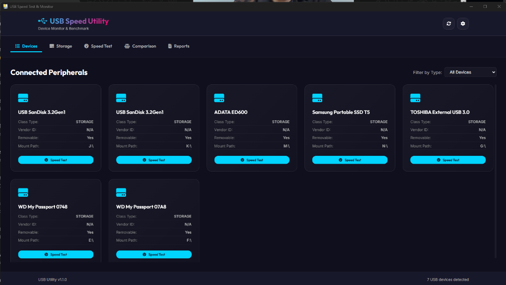

---

## 2. Storage Tab — Disk Space Analysis

High-contrast visual storage bars showing occupied vs. free capacity for every mounted USB drive.

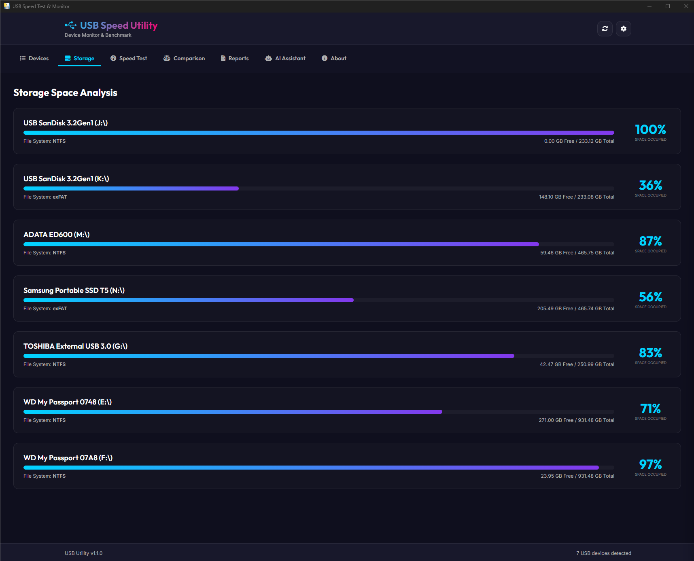

---

## 3. Speed Test Tab — Benchmark

### a) Device & size selection
Select a connected USB storage device and choose the test file size (20 MB – 250 MB).

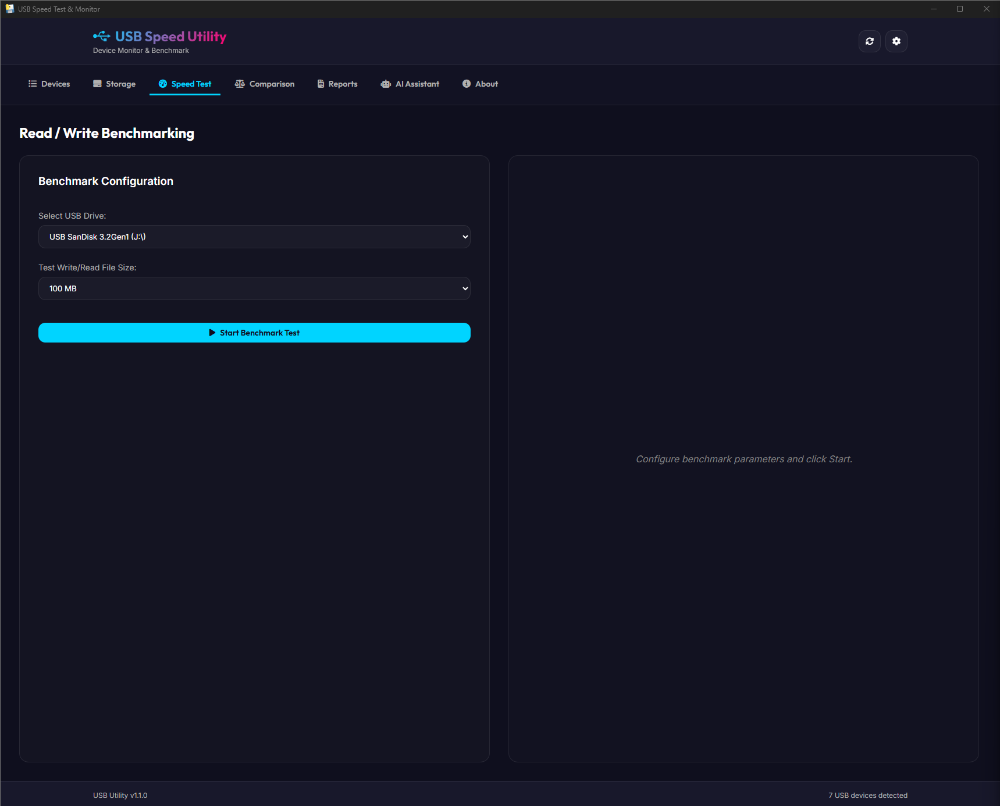

### b) Test in progress
Real-time speedometer showing live write/read throughput during the benchmark.

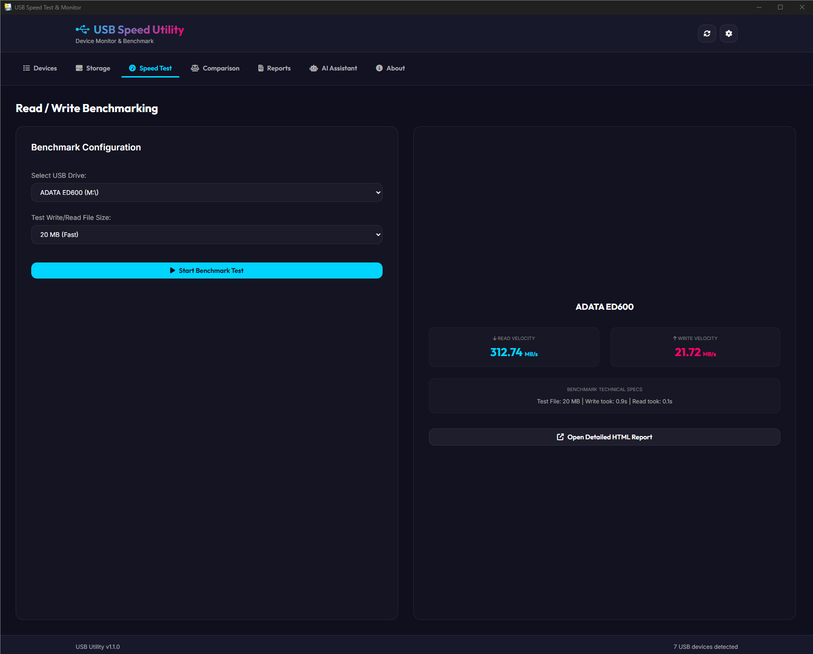

### c) Results
Completed benchmark results showing sequential write speed, read speed, and latency.

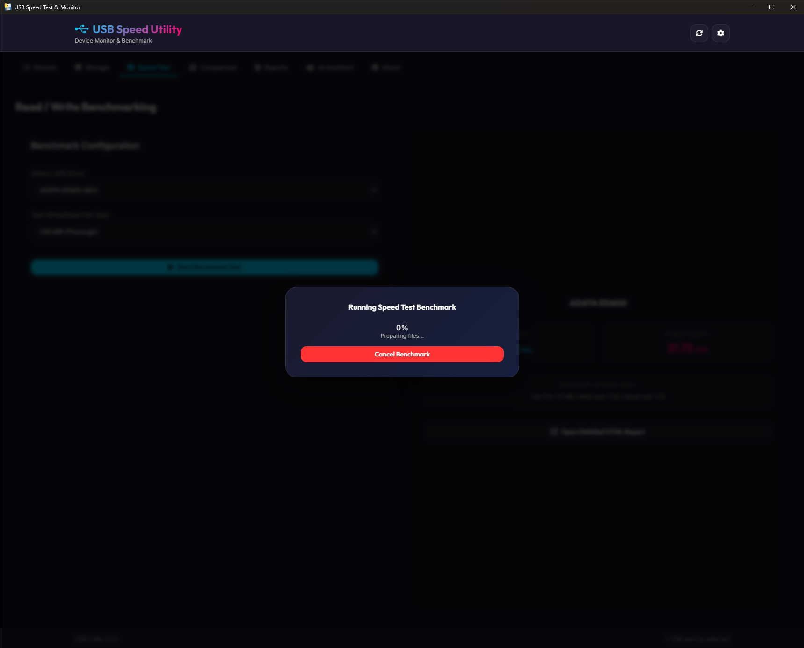

### d) Report preview
In-app HTML report preview generated after each test run.

---

## 4. Comparison Tab — Multi-Device Matrix

Select multiple test session runs to generate a side-by-side comparative performance matrix.

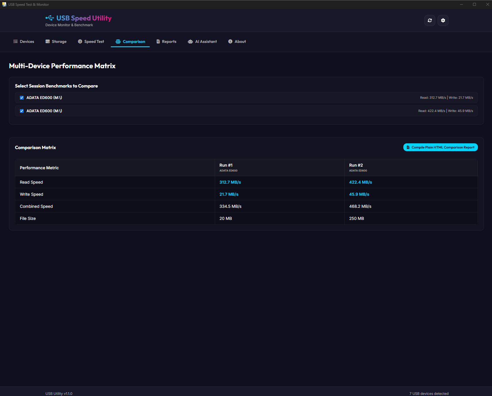

---

## 5. HTML Report — Plain Report

A generated HTML benchmark report opened in the system browser, showing full device details, throughput charts, and test metadata.

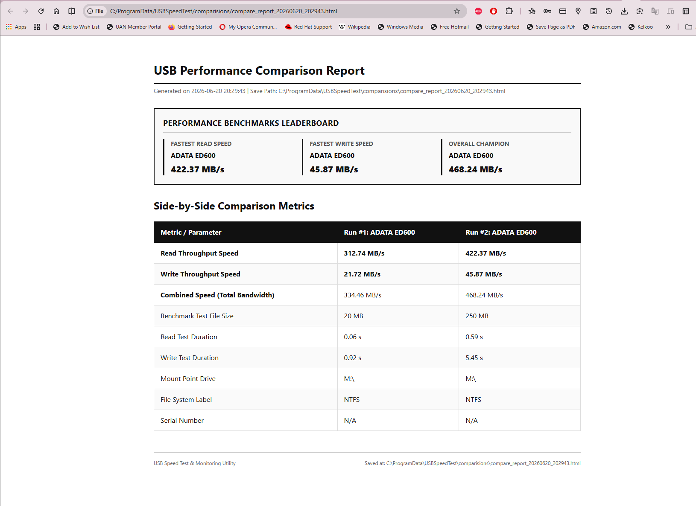

---

## 6. Reports Tab — Saved Benchmarks

All saved HTML benchmark reports listed with timestamps. Click any report to open it directly in your browser.

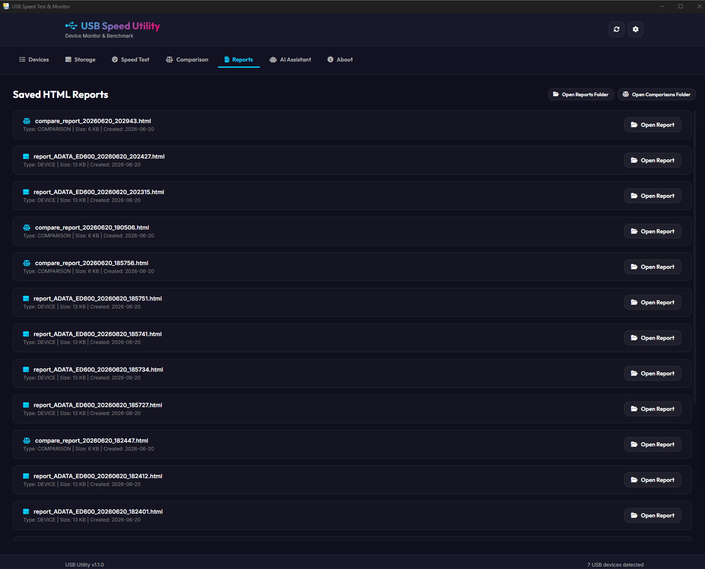

---

## 7. AI Assistant — Diagnostics Chatbot

Context-aware chatbot powered by your local or cloud LLM, scoped strictly to USB diagnostics.

### a) Welcome / initial prompt
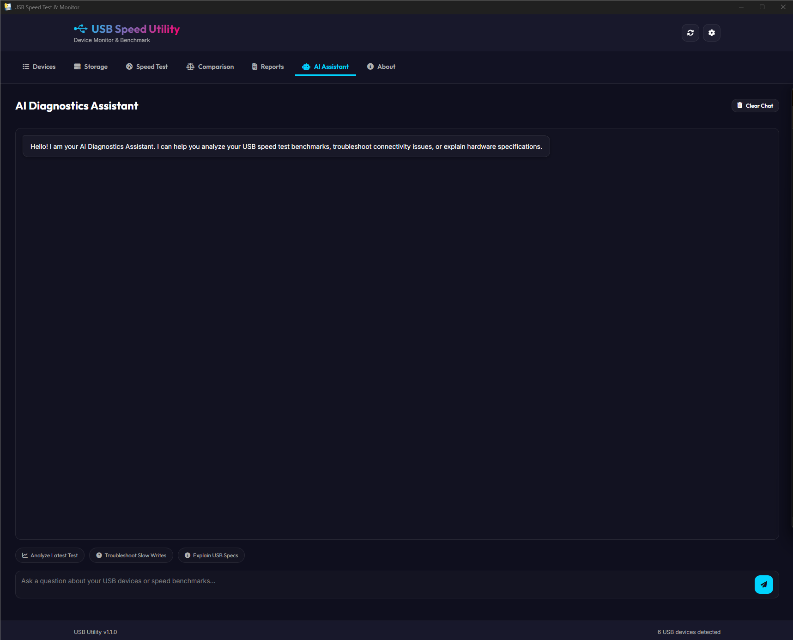

### b) Device specification query
The AI fetches live device driver details from the system and searches DuckDuckGo for hardware specs.

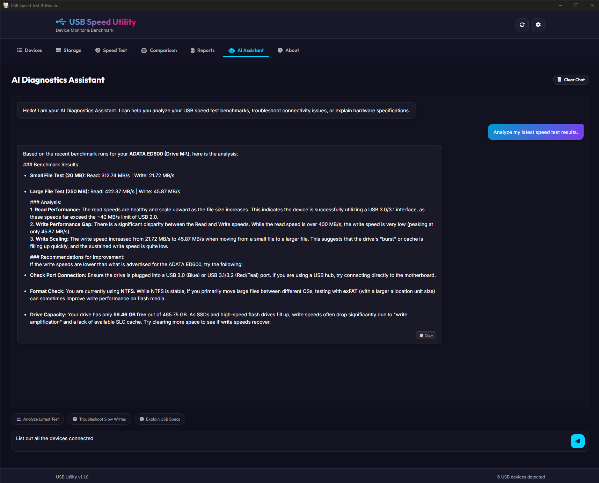

### c) Slowness email template
Ask the AI to draft a slowness report email — the response includes a **📋 Copy** button.

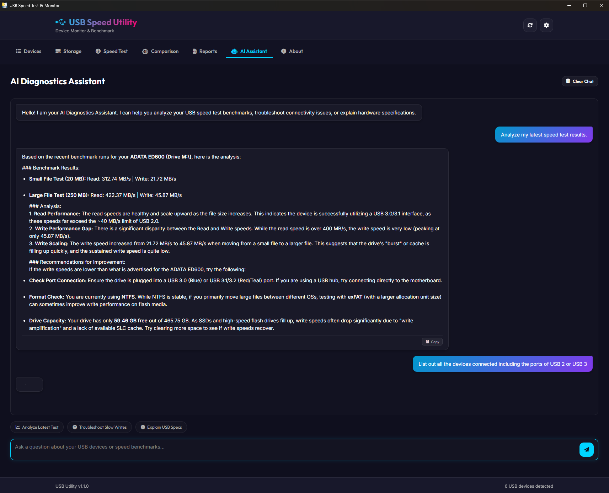

### d) Guardrail enforcement
Out-of-scope requests are gracefully rejected with a scope explanation.

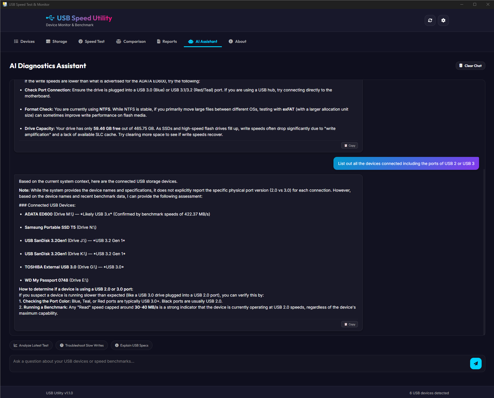

---

## 8. Application Settings — AI Configuration

Configure the AI provider (Ollama, Claude, OpenAI, Gemini, DeepSeek, Groq), endpoint, model, and export your full configuration.

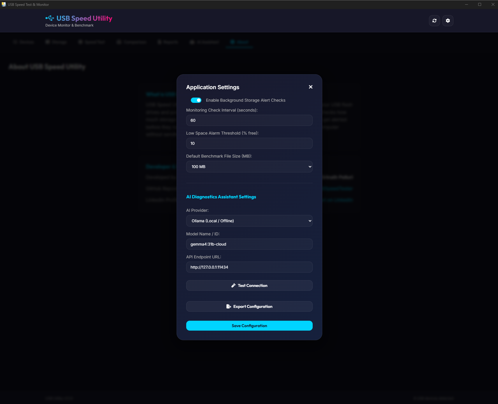

---

> 📁 All screenshot source files are located in [`docs/images/`](images/).
